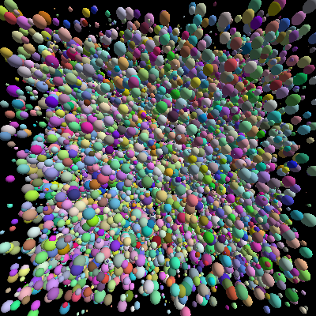
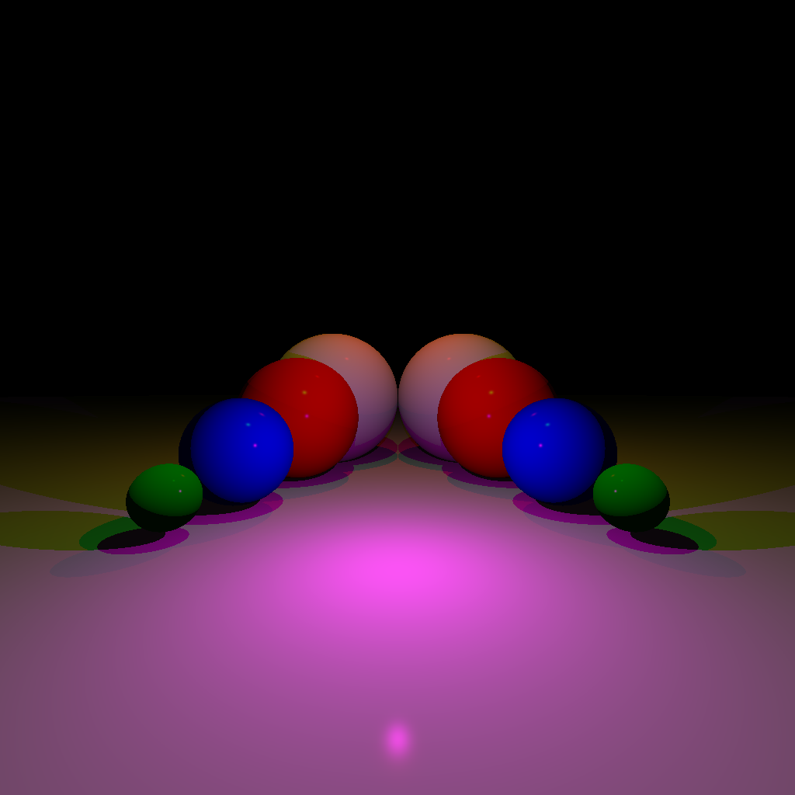
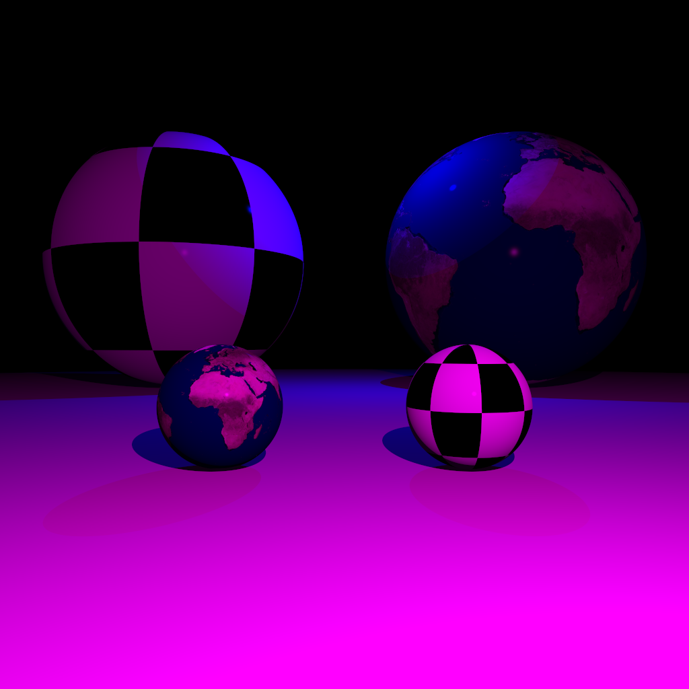

# PathTracer

Ein selbst entwickelter, schrittweise aufgebauter **Path Tracer**, der sich von einer einfachen Lichtquelle bis zur Unterstützung von komplexen `.obj`-Modellen mit beschleunigtem Rendering entwickelt hat.

---

## Funktionalitäten

- Path Tracing
- Reflektierende Materialien
- Texturierung & lokale Koordinatensysteme
- Triangle Meshes und OBJ-Import
- Beschleunigung BVH

---

## Entwicklungsschritte

### 1. Erste Szene – einfache Disc


Einstieg ins Projekt: Eine einfache Fläche (Disc).

---

### 2. Spheren als primitive Objekte



Einführung von Kugeln (Spheres) als einfache Geometrien.  

---

### 3. Schattenwurf



Erweiterung um **Schattenberechnung** durch Blockierung von Lichtstrahlen.  

---

### 4. Texturierung



Erste Oberflächentexturen mithilfe von UV-Mapping.  

---

### 5. Lokale & globale Koordinatensysteme


Einführung lokaler Transformationssysteme.  
Notwendig für komplexe Kamera- und Objekttransformationen.

---

### 6. Path Tracing & reflektierende Materialien


Implementierung des eigentlichen **Path Tracing**-Algorithmus.  
Unterstützung für spiegelnde/reflektierende Oberflächen über rekursive Strahlen.

---

### 7. Beschleunigung


**BVH** beschleunigt das Rendern erheblich.  

---

### 8–9. Triangle Meshes & OBJ-Support


Der Import von .obj-Dateien ist jetzt möglich und sie können gerendert werden.

---

## Projektstruktur

```bash
PathTracer/
├── data/             # Ressourcen
├── images/           # Screenshots der Entwicklung
├── lib/              # Bibliotheken oder externe Abhängigkeiten
├── src/              # Quellcode des Path Tracers
└── README.md         # Projektdokumentation
