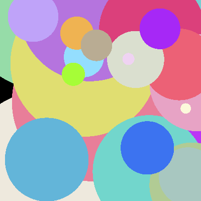

# PathTracer

Ein selbst entwickelter, schrittweise aufgebauter **Path Tracer**, der sich von einer einfachen Lichtquelle bis zur Unterstützung von komplexen `.obj`-Modellen mit beschleunigtem Rendering entwickelt hat.

---

## Funktionalitäten

- Physikalisch basiertes Path Tracing
- Unterstützung für reflektierende Materialien
- Texturierung & lokale Koordinatensysteme
- Triangle Meshes und OBJ-Import
- Multithreaded Rendering für mehr Performance

---

## Entwicklungsschritte

### 1. Erste Szene – einfache Disc



Einstieg ins Projekt: Eine einfache beleuchtete Fläche (Disc) dient als Lichtquelle.  
Grundlage für erste Lichtberechnungen und Raytracing-Logik.

---

### 2. Spheren als primitive Objekte


Einführung von Kugeln (Spheres) als grundlegende Geometrien.  
Szenen wurden komplexer, erste visuelle Tiefe entstand.

---

### 3. Schattenwurf


Erweiterung um **Schattenberechnung** durch Blockierung von Lichtstrahlen.  
Physikalisch plausiblere Szenendarstellung.

---

### 4. Texturierung


Erste Oberflächentexturen mithilfe von UV-Mapping.  
Farben und Materialien wurden realitätsnäher.

---

### 5. Lokale & globale Koordinatensysteme


Einführung lokaler Transformationssysteme.  
Notwendig für komplexe Kamera- und Objekttransformationen.

---

### 6. Path Tracing & reflektierende Materialien


Implementierung des eigentlichen **Path Tracing**-Algorithmus.  
Unterstützung für spiegelnde/reflektierende Oberflächen über rekursive Strahlen.

---

### 7. Parallelisierung


**Multithreading** beschleunigt das Rendern erheblich.  
Effizientere Ausnutzung moderner Mehrkernprozessoren.

---

### 8–9. Triangle Meshes & OBJ-Support


Volle Unterstützung für Triangle Meshes und den Import von `.obj`-Dateien.  
Realistische 3D-Modelle können gerendert werden – der Renderer unterstützt jetzt komplexe Geometrien.

---

## Projektstruktur

```bash
PathTracer/
├── data/             # Ressourcen
├── images/           # Screenshots der Entwicklung
├── lib/              # Bibliotheken oder externe Abhängigkeiten
├── src/              # Quellcode des Path Tracers
└── README.md         # Projektdokumentation
